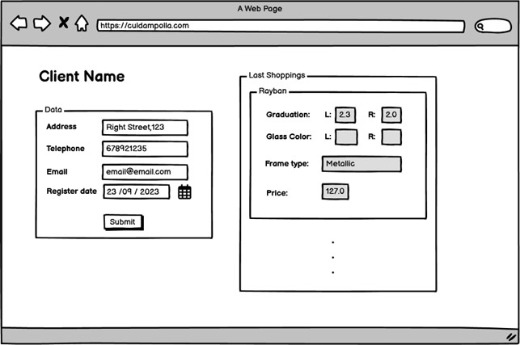
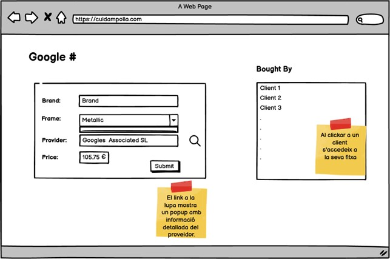

# TaskS203-MongoDBDataStructure

# Level 1

## Optics

An optical store called **“Cul d’Ampolla”** wants to computerize the management of its clients and eyeglass sales.

### Suppliers

The optical store wants to know who the supplier of each pair of glasses is. Specifically, it wants to store the following information for each supplier:

- Name
- Address (street, number, floor, door, city, postal code, and country)
- Telephone
- Fax
- Tax identification number (NIF)

### Glasses

For each pair of glasses, the store wants to record:

- Brand
- Prescription of each lens
- Type of frame (rimless, plastic, or metal)
- Frame color
- Color of each lens
- Price

### Clients

For each client, the store wants to store:

- Name
- Postal address
- Phone number
- Email address
- Registration date

When a new client arrives, the system should also store which existing client recommended the establishment to them (if applicable).

### Employees and Sales

The system must also record which employee sold each pair of glasses, and the **date and time** when the sale took place.

***

### Exercise 1

Imagine that we have the following graphical interface, from the point of view of a customer of the optical store.
How would you design the **database** that makes this information management possible?

### Exercise 2

And what if the point of view of the interface were the glasses?

# Level 2

### Exercise 1

You have been hired to design a website that allows users to place food delivery orders online.

Take into account the following guidelines to model what the project’s database would look like:

For each customer, store a unique identifier, name, surname, address, postal code, city, province, and phone number.

A person can place many orders, but each order can only be placed by a single person. For each order, store a unique identifier, the date and time of the order, whether it is for home delivery or in-store pickup, the number of products of each type that have been selected, the total price, and an optional note with additional information.

An order can include one or several products.

The products can be pizzas, burgers, and drinks. For each product, store a unique identifier, name, description, image, and price. In the case of pizzas, there are various categories whose names may change throughout the year.

Each order is managed by a single store, and a store can manage multiple orders. For each store, store a unique identifier, address, postal code, city, and province.

A store can employ many workers, but each employee can only work at one store. For each employee, store a unique identifier, name, surname, national ID (NIF), phone number, and whether they work as a cook or delivery person. For home delivery orders, it is important to record which delivery person made the delivery and the date and time of the delivery.

# Level 3

### Exercise 1

We will try to create a simple model of what the database for a reduced version of YouTube would look like.

For each user, store a unique identifier, email, password, username, date of birth, gender, country, and postal code.

A user uploads videos. For each video, store a unique identifier, title, description, size, video filename, video duration, thumbnail, number of views, number of likes, and number of dislikes.

A video can have three different statuses: public, unlisted, and private. A video can have multiple tags. It’s also important to record which user uploaded the video and the date/time it was published.

A user can create a channel. A channel has a unique identifier, name, description, and creation date.

A user can subscribe to other users’ channels. A user can give a like or dislike to a video only once. A record must be kept of which users liked or disliked a given video and the date/time when they did so.

A user can create playlists with videos they like. Each playlist has a unique identifier, name, creation date, and status indicating whether it is public or private.

A user can write comments on a specific video. Each comment is identified by a unique identifier, comment text, and the date/time it was made.

